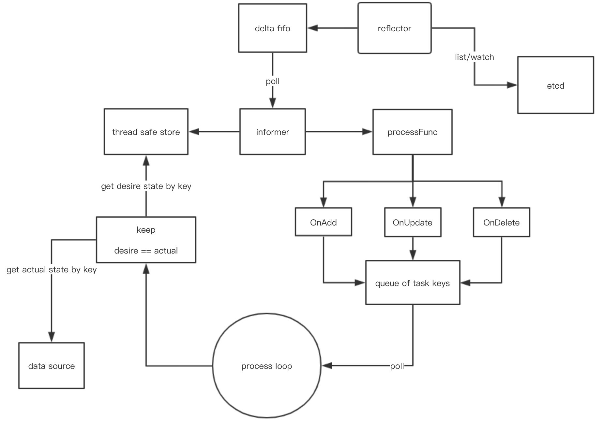

# 无需k8s也能List & Watch

## 架构图

## 功能点

1. 使用简单，与k8s controller编写方式一致，却无需依赖k8s，直接对接etcd

## 待解决的点

1. 目前list & watch etcd的时候，先list，后watch，watch的时候不带版本。这时可能导致list过程中事件无法watch到。暂时没有好的思路来解决watch的时候从哪个revision开始，所以这块作为待优化点。后续参考k8s resourceversion管理方案

## 参考文献

1. https://github.com/kubernetes/client-go
